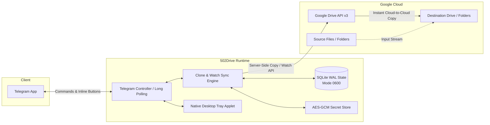

<div align="center">

# 502Drive

**High-Performance Local-First Google Drive Cloning & Realtime Sync Engine via Telegram**

[](https://github.com/GiaHung07/502Drive/actions/workflows/ci.yml)
[](https://github.com/GiaHung07/502Drive/actions/workflows/release.yml)
[](https://github.com/GiaHung07/502Drive/releases)
[](https://www.rust-lang.org/)
[](LICENSE)
[](https://github.com/GiaHung07/502Drive/releases)

[Đọc bản tiếng Việt (Vietnamese README)](README.vi.md)

</div>

---

## Overview

**502Drive** is a production-grade, local-first Telegram bot written in modern Rust for cloning Google Drive files and folders, managing destinations, and performing continuous realtime folder synchronization.

Unlike traditional mirror/leech bots that download massive files to an expensive rented VPS before re-uploading, **502Drive executes server-side Google Drive API copy operations directly within Google's cloud infrastructure**. Transfers complete almost instantaneously, consume zero local network bandwidth, and keep all tokens and state strictly on your own hardware.



---

## Key Features

- **Instant Cloud-to-Cloud Cloning**: Copies files and entire folder hierarchies server-side via Google Drive API v3.
- **Realtime Sync (`/sync <source> [destination]`)**: Synchronizes changes from source folders to destination targets using change cursor polling and event dispatchers.
- **Smart Link Detection**: Paste any Google Drive folder URL in Telegram chat to instantly get an interactive inline menu: `[Clone]`, `[Realtime Sync]`, or `[Change Destination]`.
- **Interactive Folder Browser**: Browse "My Drive" and "Shared Drives" with paginated inline buttons directly inside Telegram.
- **Job Control & Resilience**: Pause, resume, retry failed items, inspect live progress, and export JSON/CSV audit reports.
- **Zero-C Dependency**: Pure Rust TLS (`rustls`) + statically bundled SQLite. Zero external OpenSSL or shared library headaches.
- **Security Hardened**: SQLite database locked with Unix `0600` permissions; Google OAuth refresh tokens encrypted with authenticated AES-GCM.
- **Multi-Platform Native UI**:
  - **Linux**: Systemd user service + native GTK symbolic status tray applet.
  - **Windows**: Background execution + Scheduled Task registration.
  - **Docker / VPS / NAS**: 1-Click lightweight multi-stage container.

---

## Telegram Command Reference

| Command | Arguments | Description |
| :--- | :--- | :--- |
| `/sync` | `<source> [destination]` | **Realtime Sync**: sync source folder to destination. Auto-uses default destination if omitted. |
| `/clone` | `<url_or_id>` | Inspect source hierarchy, preview item count/size, and clone. |
| `/clone_here`| `<url_or_id>` | Clone directly into default destination folder without prompts. |
| `/menu` | - | Open the interactive Telegram Control Center. |
| `/destination`| - | View or change saved destination profiles. |
| `/set_destination` | `<url_or_id>` | Set the default destination folder. |
| `/clear_destination` | - | Remove the current default destination folder. |
| `/jobs` | - | List active, paused, and completed jobs. |
| `/status` | `[job_id]` | View detailed status of a specific job. |
| `/pause` | `<job_id>` | Pause an ongoing transfer job. |
| `/resume` | `<job_id>` | Resume a paused transfer job. |
| `/cancel` | `<job_id>` | Cancel an active job with confirmation modal. |
| `/retry` | `<job_id>` | Retry failed items within a job. |
| `/last_report` | - | Receive JSON and CSV report files of the latest job. |
| `/preview` | - | View realtime transfer speed and active worker status. |
| `/watches` | - | List active realtime synchronization watches. |
| `/watch_status` | `<watch_id>` | Inspect sync backlog, cursor, and update policy. |
| `/watch_pause` | `<watch_id>` | Temporarily pause applying changes to destination. |
| `/watch_resume` | `<watch_id>` | Resume applying synced changes to destination. |
| `/watch_policy` | `<id> <policy>` | Change update policy (`versioned_copy` \| `replace_copy` \| `manual_confirmation`). |
| `/unwatch` | `<watch_id>` | Stop syncing and delete the watch subscription. |
| `/account` | - | Check Google account status and switch UI language. |
| `/whoami` | - | View your Telegram ID and authorization level. |
| `/grant` | `<user_id>` | Grant operator access to a user (*owner only*). |
| `/revoke` | `<user_id>` | Revoke operator access (*owner only*). |

---

## Installation & Deployment

### Method 1: Pre-Built Binary (GitHub Releases)

Download pre-compiled binaries for your architecture from [Releases](https://github.com/GiaHung07/502Drive/releases):

#### Linux (x86_64 / aarch64)
```bash
# Download and extract the bundle
tar -xzf 502drive-v*-linux-x86_64.tar.gz
cd 502drive-v*-linux-x86_64

# Run universal installer
bash packaging/install.sh
```

#### Windows (x86_64)
1. Download `502drive-v*-windows-x86_64.zip` and extract to a folder (e.g. `C:\Tools\502Drive`).
2. Copy `config.sample.toml` to `config.toml` and configure credentials.
3. Run `502drive.exe run` or register as a startup task via `powershell .\windows-task.ps1`.

---

### Method 2: 1-Click Docker Compose (VPS / NAS / Homelab)

Ideal for Oracle Cloud Free Tier, Hetzner, Synology, Unraid, or TrueNAS.

```bash
# 1. Clone repository
git clone https://github.com/GiaHung07/502Drive.git
cd 502Drive

# 2. Setup config
mkdir -p config data
cp config.sample.toml config/config.toml
# Edit config/config.toml with your credentials

# 3. Launch container
docker compose up -d

# 4. View live logs
docker compose logs -f
```

---

### Method 3: Build from Source

Prerequisites: Rust 1.85+ (Rust 2024 edition).

```bash
git clone https://github.com/GiaHung07/502Drive.git
cd 502Drive

# Build optimized binary
cargo build --release --bin 502drive

# Test installation
./target/release/502drive --help
```

---

## Configuration (`config.toml`)

Create `~/.config/gdclone-bot/config.toml` (or `./config/config.toml` when using Docker):

```toml
[telegram]
# Token from @BotFather
bot_token = "123456789:ABCdefGhIJKlmNoPQRsTUVwxyZ"
# [NOTE] 987654321 is a SAMPLE PLACEHOLDER!
# Replace with your actual Telegram User ID (get it from @userinfobot or /whoami)
owner_telegram_id = 987654321
progress_edit_min_interval_ms = 3000
language = "vi" # "vi" or "en"

[destination]
auto_use_default = true
auto_confirm_clone = false
wrap_single_file_in_folder = false
root_name_policy = "preserve"
same_name_policy = "keep_both"

[google_oauth]
client_id = "YOUR_CLIENT_ID.apps.googleusercontent.com"
client_secret = "YOUR_CLIENT_SECRET"
redirect_port_start = 51000
redirect_port_end = 51100
scope = "https://www.googleapis.com/auth/drive"

[engine]
max_active_jobs = 2
max_active_jobs_per_user = 1
initial_write_concurrency = 5
min_write_concurrency = 1
max_write_concurrency = 8
list_concurrency = 2
max_retry_attempts = 6
retry_base_delay_ms = 1000
retry_max_delay_ms = 64000
request_timeout_seconds = 60
default_duplicate_policy = "skip_same_source"
default_shortcut_policy = "preserve"

[watch]
enabled = true
active_poll_seconds = 20
warm_idle_poll_seconds = 60
cold_idle_poll_seconds = 300
default_content_update_policy = "versioned_copy"
default_deletion_policy = "preserve_destination"
default_move_out_policy = "detach"

[security]
redact_file_names_in_info_logs = true
report_retention_days = 30
allow_operators = false
```

---

## Security Model

1. **Physical Filesystem Protection**: SQLite database files are initialized with `0600` (`rw-------`) permissions and parent directory with `0700` (`rwx------`) on Unix systems, preventing local user snooping.
2. **Encrypted Token Store**: Refresh tokens and Google credentials are encrypted at rest using AES-256-GCM.
3. **Owner Isolation**: Only authorized Telegram user IDs can execute bot commands. Strangers messaging the bot are immediately blocked and logged.
4. **No External Attack Surface**: Because 502Drive operates via Telegram Long Polling and local loopback OAuth, no public ports, domain names, or reverse proxies need to be opened to the internet.

---

## License

This project is licensed under the **GNU General Public License v3.0 (GPL-3.0)**. See the [LICENSE](LICENSE) file for details.
