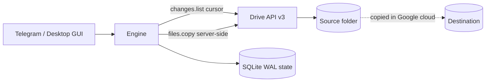
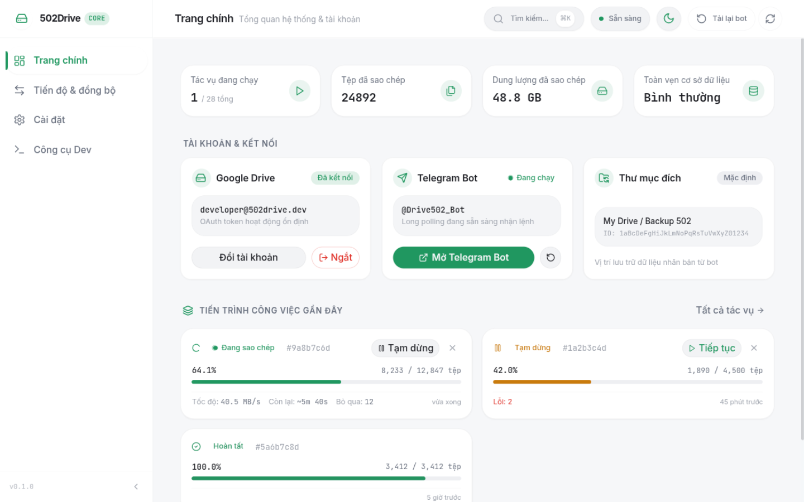

<div align="center">

# 502Drive

**Local-first Google Drive clone & realtime one-way sync engine — controlled from Telegram or a native desktop GUI.**

[](https://github.com/GiaHung07/502Drive/actions/workflows/ci.yml)
[](https://github.com/GiaHung07/502Drive/actions/workflows/release.yml)
[](https://github.com/GiaHung07/502Drive/releases)
[](https://www.rust-lang.org/)
[](LICENSE)
[](https://github.com/GiaHung07/502Drive/releases)

[Đọc bản tiếng Việt (Vietnamese README)](README.vi.md)


</div>

---

## What is 502Drive?

502Drive is a **local-first Google Drive clone** plus a **realtime one-way sync engine**, written in Rust. You drive it from a **Telegram bot** (cloud-to-cloud cloning, job control, watch management) and from a **Tauri v2 desktop GUI** (React 19) on Linux.

Everything — the database, the encryption key, the logs — lives on your own machine. File data never passes through 502Drive: copies are executed **server-side inside Google's cloud** via the Drive API.

> **One binary, three names.** The repo builds a single `src/main.rs` into two identically-behaving binaries:
> - **`502drive`** — the main daemon/CLI (canonical name).
> - **`gdclone-bot`** — an alias of the same binary (kept for historical/config-path reasons; the config directory is `~/.config/gdclone-bot/`).
> - **`502drive-gui`** — the Tauri desktop app, a separate binary.
>
> Docs may use either `502drive` or `gdclone-bot` — they are the same program.

## Why 502Drive?

- **Server-side copy = fast & low bandwidth.** Clones use `files.copy` inside Google's infrastructure — no download/re-upload relay, finishes in seconds, uses almost none of your server's bandwidth.
- **Local-first.** Your tokens, state and reports stay in a local SQLite database on your hardware — not on someone else's server.
- **BYOK (Bring Your Own Keys).** Use your own Google Cloud OAuth Client ID/Secret (like rclone), or the 1-tap preset in the GUI setup wizard.
- **Telegram control + desktop GUI.** Manage clones, jobs and realtime watches from chat; monitor everything from the native desktop dashboard.

## Feature status

| Capability | Status |
| :--- | :--- |
| Cloud-to-cloud clone (`files.copy`, folders & Shared Drives) | ✅ Working |
| Realtime one-way watch (source → destination, Drive Changes API) | ✅ Working |
| Telegram bot control (jobs, watches, destinations, permissions) | ✅ Working |
| Desktop GUI dashboard (Tauri v2 / React 19, Linux) | ✅ Working |
| Doctor / preflight checks | ✅ Working |
| Docker headless daemon | ✅ Working |
| Windows builds + Task Scheduler install | 🟡 Community verification welcome |
| Two-way sync | 🚧 In progress / roadmap |
| Drive push webhooks (VPS, no polling) | 🚧 In progress / roadmap |
| Multi-account UI | 🚧 In progress / roadmap |
| GUI folder browser | 🚧 In progress / roadmap |

## Quick start

> Requires a Telegram bot token (from [@BotFather](https://t.me/BotFather)), your Telegram user ID, and Google OAuth credentials — see [docs/oauth-setup.md](docs/oauth-setup.md).

### 1. Docker Compose (VPS / NAS / homelab)

```bash
git clone https://github.com/GiaHung07/502Drive.git && cd 502Drive
mkdir -p config data
cp config.sample.toml config/config.toml
# Edit config/config.toml: bot_token, owner_telegram_id, google_oauth client_id/secret
docker compose up -d
docker compose logs -f
```

Full guide: [docs/install-docker.md](docs/install-docker.md).

### 2. Linux install script + systemd user service

```bash
# Download and extract a release bundle (x86_64 / aarch64)
tar -xzf 502drive-v*-linux-x86_64.tar.gz && cd 502drive-v*-linux-x86_64
# Install the binary, tray assets and the systemd user service
bash packaging/install.sh
systemctl --user enable --now gdclone-bot.service
```

### 3. Build from source

```bash
git clone https://github.com/GiaHung07/502Drive.git && cd 502Drive
cargo build --release --bin 502drive
./target/release/502drive --help
```

Requires Rust 1.85+ (2024 edition).

### Windows

Windows builds ship with a Task Scheduler logon-task installer (`502drive service-install`). See [docs/install-windows.md](docs/install-windows.md). Windows is not yet fully verified — community testing and reports are welcome.

## How sync works

Sync is **one-way: source → destination**, driven by the Google Drive **Changes API** (`changes.list`, polled at account scope). The destination is a mirror target — edits made in the destination are never copied back.



- **Adaptive polling**: 10s / 60s / 300s (active / warm / cold). While a watched source is actively changing, edits typically appear in the destination within seconds to tens of seconds; idle watches back off automatically.
- **Deletion policy** — default `preserve_destination`: if a source file is deleted, trashed, or becomes inaccessible, the destination copy is **kept**.
- **Move-out** — `detach`: a file moved out of the source folder is detached from the watch mapping (move-back reuses the existing mapping).
- **Content-update policies** (change via `/watch_policy`): `versioned_copy` (default — new copy alongside the old), `replace_copy` (overwrite in place), `manual_confirmation` (ask before applying).

Full semantics: [docs/sync-semantics.md](docs/sync-semantics.md).

**Engine integrity:** state lives in SQLite (WAL mode) with a transactional change cursor, idempotency keys, and crash recovery — an interrupted run resumes without duplicating work. All copies are server-side (`files.copy`), so file contents never pass through the app.

## Configuration

Config file: `~/.config/gdclone-bot/config.toml` (native/desktop) or `/config/config.toml` (Docker). Every value can be overridden with environment variables named `GDCLONE__SECTION__KEY` (double underscore). Full reference: [config.sample.toml](config.sample.toml).

```toml
[telegram]
bot_token = "123456789:ABC..."        # from @BotFather
owner_telegram_id = 987654321          # your Telegram user ID (/whoami)
language = "vi"                        # "vi" | "en"

[google_oauth]
client_id = "YOUR_ID.apps.googleusercontent.com"   # BYOK: your own OAuth client
client_secret = "YOUR_SECRET"
redirect_port_start = 51000            # loopback OAuth range 51000-51100
redirect_port_end = 51100

[engine]
max_active_jobs = 2
initial_write_concurrency = 5

[watch]
enabled = false                        # realtime watch is opt-in by default
default_content_update_policy = "versioned_copy"
default_deletion_policy = "preserve_destination"
default_move_out_policy = "detach"
```

Main environment overrides (all follow the `GDCLONE__SECTION__KEY` pattern):

| Variable | Overrides |
| :--- | :--- |
| `GDCLONE__TELEGRAM__BOT_TOKEN` | Telegram bot token |
| `GDCLONE__TELEGRAM__OWNER_TELEGRAM_ID` | Owner Telegram user ID |
| `GDCLONE__TELEGRAM__LANGUAGE` | UI language (`vi` / `en`) |
| `GDCLONE__GOOGLE_OAUTH__CLIENT_ID` | Google OAuth Client ID |
| `GDCLONE__GOOGLE_OAUTH__CLIENT_SECRET` | Google OAuth Client Secret |
| `GDCLONE__GOOGLE_OAUTH__SCOPE` | OAuth scope |
| `GDCLONE__ENGINE__MAX_ACTIVE_JOBS` | Max concurrent jobs |
| `GDCLONE__ENGINE__INITIAL_WRITE_CONCURRENCY` | Copy concurrency |
| `GDCLONE__ENGINE__MAX_RETRY_ATTEMPTS` | Retry budget per item |
| `GDCLONE__STORAGE__DB_PATH` | SQLite database path |
| `GDCLONE__STORAGE__LOG_DIR` / `GDCLONE__STORAGE__REPORT_DIR` | Log / report directories |

## Telegram commands

Start with `/start`, then `/connect` to link your Google account. The most useful commands:

| Command | Description |
| :--- | :--- |
| `/connect` | Instructions for signing in to Google on the machine running the bot |
| `/account` | Google account status |
| `/clone <url_or_id>` | Inspect and clone a Drive file/folder (server-side copy) |
| `/clone_here <url_or_id>` | Clone directly into the default destination |
| `/sync <source> [destination]` | Create a realtime one-way watch (auto-uses default destination) |
| `/watches` · `/watch_status <id>` | List watches · inspect backlog, cursor and policies |
| `/watch_pause <id>` · `/watch_resume <id>` | Pause/resume applying changes |
| `/watch_policy <id> <policy>` | Change update policy (`versioned_copy` \| `replace_copy` \| `manual_confirmation`) |
| `/unwatch <id>` | Stop a watch and delete its subscription |
| `/set_destination <url_or_id>` · `/destination` · `/clear_destination` | Manage the default destination |
| `/jobs` · `/status [job_id]` | List jobs · inspect one job |
| `/pause` · `/resume` · `/cancel` · `/retry` | Job control (per job id) |
| `/last_report` | Get JSON/CSV report of the latest job |
| `/grant <user_id>` · `/revoke <user_id>` | Owner manages the operator allowlist |
| `/whoami` | Your Telegram ID and authorization level |

The complete list is available in the bot via `/help`.

## Desktop GUI (Linux)

502Drive ships with a Tauri v2 desktop app (`502drive-gui`, React 19) for Linux.

- **Dashboard** — stats plus account / bot / destination cards and recent jobs.
- **Jobs** — search and filters, pause / resume / cancel.
- **Settings** — engine concurrency, dark/light theme, language (vi/en), and bot configuration via a **4-step setup wizard** (including a 1-tap preset for Google OAuth credentials).
- **Dev tools** — doctor diagnostics and logs.
- **Keyboard-first** — `⌘K` opens the command palette.

<div align="center">

</div>

## Security & privacy

- **No system keyring** — the Google refresh token is encrypted with **AES-256-GCM**; the key is stored in a local `master.key` file with `0600` permissions.
- **OAuth** — installed-app loopback flow with PKCE on ports 51000–51100; no public redirect endpoints.
- **Telegram authorization** — owner/operator allowlist; **every incoming message is checked** before any command runs.
- **No public attack surface** — Telegram long polling + loopback OAuth means no open inbound ports.
- File contents never transit 502Drive (server-side copies only).

Details: [PRIVACY.md](PRIVACY.md) · [docs/threat-model.md](docs/threat-model.md) · [SECURITY.md](SECURITY.md)

## FAQ

**Does deleting a file in the source delete it in the destination?**
No. The default deletion policy is `preserve_destination` — destination files survive source deletions, trash events and permission loss. Move-outs detach the mapping instead of deleting anything.

**How fast is realtime sync?**
Polling adapts to activity: 10s while a source is actively changing, backing off to 60s and 300s when idle. In practice, changes are applied within seconds to tens of seconds while the watch is active.

**Does it use my server's bandwidth?**
Almost none. Cloning uses Google's server-side `files.copy`; file data moves inside Google's cloud, not through your machine.

**Where is my data?**
On your machine: a local SQLite database, encrypted tokens, and `master.key`. Nothing is stored on any third-party server besides Telegram's message transport.

**Why do I need my own Google OAuth Client ID/Secret (BYOK)?**
Google caps OAuth apps in testing at 100 users. 502Drive follows the rclone model: bring your own Client ID/Secret (see [docs/oauth-setup.md](docs/oauth-setup.md)), or use the 1-tap preset in the GUI setup wizard.

**Is Windows supported?**
Windows builds and the Task Scheduler logon-task install (`service-install`) ship today, but full verification is still pending — community testing is welcome. Linux and Docker are the primary targets.

## Documentation

| Document | Contents |
| :--- | :--- |
| [docs/install-docker.md](docs/install-docker.md) | Docker Compose deployment |
| [docs/install-windows.md](docs/install-windows.md) | Windows install & Task Scheduler |
| [docs/oauth-setup.md](docs/oauth-setup.md) | BYOK Google Cloud OAuth setup |
| [docs/sync-semantics.md](docs/sync-semantics.md) | One-way watch semantics & policies |
| [docs/architecture.md](docs/architecture.md) | System architecture |
| [docs/architecture.md](docs/architecture.md) | Architecture ADRs, recovery model & integrity |
| [docs/threat-model.md](docs/threat-model.md) | Threat model |
| [docs/troubleshooting.md](docs/troubleshooting.md) | Common issues |
| [docs/install-linux.md](docs/install-linux.md) | Linux install & systemd user service |

## Roadmap

- Two-way sync
- Drive push webhooks (event-driven watches on a VPS)
- Multi-account UI
- GUI folder browser

## Contributing

Contributions are welcome — see [CONTRIBUTING.md](CONTRIBUTING.md). For security issues, please follow [SECURITY.md](SECURITY.md) instead of opening a public issue.

## License

Licensed under the **GNU GPL-3.0** — see [LICENSE](LICENSE). Third-party notices: [THIRD_PARTY_NOTICES.md](THIRD_PARTY_NOTICES.md).

**Privacy:** 502Drive is local-first — your tokens, database and reports stay on your hardware. See [PRIVACY.md](PRIVACY.md) for what is (and is not) transmitted.
