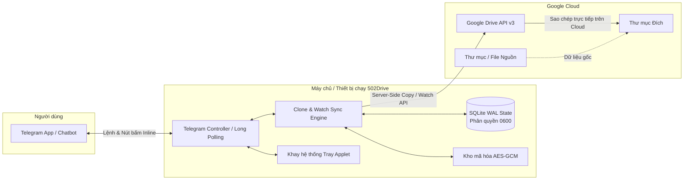

<div align="center">

# 502Drive

**Hệ thống Sao chép & Đồng bộ Realtime Google Drive Local-first Hiệu Năng Cao qua Telegram**

[](https://github.com/GiaHung07/502Drive/actions/workflows/ci.yml)
[](https://github.com/GiaHung07/502Drive/actions/workflows/release.yml)
[](https://github.com/GiaHung07/502Drive/releases)
[](https://www.rust-lang.org/)
[](LICENSE)
[](https://github.com/GiaHung07/502Drive/releases)

[English README](README.md)

</div>

---

## Giới thiệu tổng quan

**502Drive** là bot Telegram chuẩn production, kiến trúc local-first được phát triển hoàn toàn bằng Rust hiện đại nhằm giải quyết bài toán sao chép (clone), quản lý thư mục đích và đồng bộ thời gian thực (realtime sync) giữa các tài khoản Google Drive cá nhân và Shared Drives (Bộ nhớ dùng chung).

Khác biệt hoàn toàn với các mirror/leech bot truyền thống vốn phải tải hàng chục GB về máy chủ trung gian rồi mới upload lại, **502Drive kích hoạt lệnh sao chép server-side trực tiếp thông qua Google Drive API v3 ngay trong hạ tầng đám mây của Google**. Quá trình sao chép diễn ra gần như tức thì, không tốn băng thông mạng tải về, bảo mật tuyệt đối mã truy cập và lưu trữ trạng thái ngay trên máy tính của bạn.



---

## Tính năng nổi bật

- **Sao chép siêu tốc (Cloud-to-Cloud Copy)**: Clone tệp đơn hoặc toàn bộ cấu trúc thư mục lồng nhau trực tiếp trên máy chủ Google qua Drive API v3.
- **Đồng bộ thời gian thực (`/sync <nguồn> [đích]`)**: Tự động theo dõi các thay đổi ở thư mục nguồn và đồng bộ sang thư mục đích. Tự động nhận diện thư mục đích mặc định khi chỉ truyền 1 tham số.
- **Nhận diện link thông minh (Smart Link Detection)**: Dán trực tiếp bất kỳ link thư mục Google Drive nào vào khung chat Telegram để mở ngay menu tương tác: `[Sao chép (Clone)]`, `[Đồng bộ (Realtime Sync)]`, hoặc `[Đổi thư mục đích]`.
- **Duyệt thư mục trực quan (Visual Drive Browser)**: Duyệt "My Drive" và "Shared Drives" qua hệ thống nút bấm phân trang trực tiếp trong Telegram để chọn thư mục đích chỉ với vài cú chạm.
- **Kiểm soát Job linh hoạt**: Tạm dừng (pause), tiếp tục (resume), thử lại file lỗi (retry failed), xem thanh tiến trình động theo thời gian thực và xuất báo cáo kiểm toán định dạng JSON/CSV.
- **Độc lập hoàn toàn (Zero-C Dependency)**: Sử dụng thuần Rust TLS (`rustls`) và SQLite bundled tĩnh. Không cần cài đặt OpenSSL hay các thư viện runtime phức tạp.
- **Bảo mật chuẩn chuyên sâu (Hardened Security)**: Cơ sở dữ liệu SQLite tự động khóa quyền `0600` (`rw-------`) trên Unix; Google OAuth refresh token được mã hóa an toàn bằng thuật toán AES-256-GCM.
- **Giao diện đa nền tảng**:
  - **Linux**: Dịch vụ nền systemd user service + Khay hệ thống (System Tray) GTK symbolic native.
  - **Windows**: Chạy nền tự khởi động cùng Windows qua Scheduled Task.
  - **Docker / VPS / NAS**: Triển khai 1-click nhẹ nhàng tối ưu tài nguyên.

---

## Bảng tra cứu lệnh Telegram

| Lệnh | Tham số | Mô tả tính năng |
| :--- | :--- | :--- |
| `/sync` | `<nguồn> [đích]` | **Đồng bộ Realtime**: Đồng bộ thư mục nguồn sang đích. Tự động dùng đích mặc định nếu bỏ qua đích. |
| `/clone` | `<url_hoặc_id>` | Quét thư mục nguồn, hiển thị số lượng file/dung lượng và xác nhận clone. |
| `/clone_here`| `<url_hoặc_id>` | Clone ngay lập tức vào thư mục đích mặc định mà không cần hỏi lại. |
| `/menu` | - | Mở Bảng điều khiển chính (Control Center) dạng nút bấm. |
| `/destination`| - | Xem danh sách các thư mục đích đã lưu hoặc chọn thư mục mặc định. |
| `/set_destination` | `<url_hoặc_id>` | Cài đặt thư mục đích mặc định mới. |
| `/clear_destination` | - | Xóa thư mục đích mặc định. |
| `/jobs` | - | Liệt kê danh sách các job đang chạy, tạm dừng hoặc hoàn tất. |
| `/status` | `[job_id]` | Xem chi tiết tiến độ, tốc độ và các file của một job. |
| `/pause` | `<job_id>` | Tạm dừng một job đang chạy. |
| `/resume` | `<job_id>` | Tiếp tục chạy job đã tạm dừng. |
| `/cancel` | `<job_id>` | Hủy job với bảng xác nhận an toàn. |
| `/retry` | `<job_id>` | Thử lại các file/thư mục bị lỗi trong job. |
| `/last_report` | - | Tải về file báo cáo chi tiết JSON và CSV của job gần nhất. |
| `/preview` | - | Xem bảng theo dõi tiến độ tổng thể realtime trong chat. |
| `/watches` | - | Xem danh sách các cặp thư mục đang đồng bộ thời gian thực. |
| `/watch_status` | `<watch_id>` | Kiểm tra chi tiết backlog, con trỏ cursor và chính sách xử lý file. |
| `/watch_pause` | `<watch_id>` | Tạm dừng áp dụng thay đổi vào thư mục đích. |
| `/watch_resume` | `<watch_id>` | Tiếp tục áp dụng các thay đổi từ nguồn sang đích. |
| `/watch_policy` | `<id> <policy>` | Thay đổi chính sách ghi đè file (`versioned_copy` \| `replace_copy` \| `manual_confirmation`). |
| `/unwatch` | `<watch_id>` | Dừng đồng bộ và hủy đăng ký theo dõi thư mục. |
| `/account` | - | Xem trạng thái liên kết tài khoản Google và đổi ngôn ngữ hiển thị. |
| `/whoami` | - | Xem ID Telegram của bạn và quyền hạn hiện tại. |
| `/grant` | `<user_id>` | Cấp quyền điều khiển bot cho người dùng khác (*chỉ Owner*). |
| `/revoke` | `<user_id>` | Thu hồi quyền điều khiển bot (*chỉ Owner*). |

---

## Hướng dẫn cài đặt & Triển khai

### Cách 1: Tải bản đóng gói sẵn (GitHub Releases)

Tải gói cài đặt biên dịch sẵn cho hệ điều hành của bạn tại mục [Releases](https://github.com/GiaHung07/502Drive/releases):

#### Linux (x86_64 / aarch64 - PC, Laptop, VPS, Raspberry Pi)
```bash
# Giải nén gói cài đặt
tar -xzf 502drive-v*-linux-x86_64.tar.gz
cd 502drive-v*-linux-x86_64

# Chạy trình cài đặt tự động
bash packaging/install.sh
```

#### Windows (x86_64 - Windows 10, 11, Windows Server)
1. Tải file `502drive-v*-windows-x86_64.zip` và giải nén (ví dụ `C:\502Drive`).
2. Copy `config.sample.toml` thành `config.toml` và điền Bot Token, Google Client ID/Secret.
3. Chạy lệnh: `502drive.exe run` hoặc đăng ký khởi động cùng hệ thống bằng quyền Admin PowerShell: `.\windows-task.ps1`.

---

### Cách 2: Triển khai 1-Click bằng Docker Compose (VPS / NAS / Máy chủ cá nhân)

Lựa chọn lý tưởng cho các VPS miễn phí (Oracle Cloud Free Tier), Hetzner hoặc NAS gia đình (Synology, Unraid, TrueNAS):

```bash
# 1. Clone repository
git clone https://github.com/GiaHung07/502Drive.git
cd 502Drive

# 2. Chuẩn bị cấu hình
mkdir -p config data
cp config.sample.toml config/config.toml
# Mở file config/config.toml để điền thông tin xác thực

# 3. Khởi chạy bot nền container
docker compose up -d

# 4. Xem nhật ký hoạt động
docker compose logs -f
```

---

### Cách 3: Biên dịch từ mã nguồn (Build from Source)

Yêu cầu: Rust phiên bản 1.85 trở lên (Rust 2024 edition).

```bash
git clone https://github.com/GiaHung07/502Drive.git
cd 502Drive

# Biên dịch binary tối ưu release
cargo build --release --bin 502drive

# Kiểm tra chạy thử
./target/release/502drive --help
```

---

## Mẫu cấu hình chuẩn (`config.toml`)

Tạo file tại `~/.config/gdclone-bot/config.toml` (hoặc `./config/config.toml` nếu dùng Docker):

```toml
[telegram]
# Token lấy từ @BotFather
bot_token = "123456789:ABCdefGhIJKlmNoPQRsTUVwxyZ"
# [LƯU Ý] 987654321 là ID MẪU VÍ DỤ!
# Hãy thay bằng Telegram User ID thực tế của bạn (lấy bằng cách chat với @userinfobot hoặc gõ /whoami)
owner_telegram_id = 987654321
progress_edit_min_interval_ms = 3000
language = "vi" # "vi" hoặc "en"

[destination]
auto_use_default = true
auto_confirm_clone = false
wrap_single_file_in_folder = false
root_name_policy = "preserve"
same_name_policy = "keep_both"

[google_oauth]
client_id = "CLIENT_ID_CUA_BAN.apps.googleusercontent.com"
client_secret = "CLIENT_SECRET_CUA_BAN"
redirect_port_start = 51000
redirect_port_end = 51100
scope = "https://www.googleapis.com/auth/drive"

[engine]
max_active_jobs = 2
max_active_jobs_per_user = 1
initial_write_concurrency = 5
min_write_concurrency = 1
max_write_concurrency = 8
list_concurrency = 2
max_retry_attempts = 6
retry_base_delay_ms = 1000
retry_max_delay_ms = 64000
request_timeout_seconds = 60
default_duplicate_policy = "skip_same_source"
default_shortcut_policy = "preserve"

[watch]
enabled = true
active_poll_seconds = 20
warm_idle_poll_seconds = 60
cold_idle_poll_seconds = 300
default_content_update_policy = "versioned_copy"
default_deletion_policy = "preserve_destination"
default_move_out_policy = "detach"

[security]
redact_file_names_in_info_logs = true
report_retention_days = 30
allow_operators = false
```

---

## Mô hình bảo mật

1. **Bảo vệ vật lý tập tin**: Database SQLite được gán quyền nghiêm ngặt `0600` (`rw-------`) và thư mục cha `0700` (`rwx------`) trên Unix, ngăn chặn các tài khoản khác trên máy chủ truy cập trái phép.
2. **Mã hóa token lưu trữ**: Mã làm mới OAuth (Refresh Token) được mã hóa đối xứng AES-256-GCM trước khi ghi vào cơ sở dữ liệu.
3. **Phân quyền người dùng**: Chỉ ID người dùng Telegram được cấp quyền mới có thể điều khiển bot. Người lạ gửi tin nhắn tới bot sẽ bị chặn tức thì.
4. **Không mở cổng tấn công**: Hoạt động qua giao thức Telegram Long Polling và OAuth loopback cục bộ, không yêu cầu mở cổng công khai hay thiết lập reverse proxy ra internet.

---

## Giấy phép (License)

Dự án được phát hành theo giấy phép **GNU General Public License v3.0 (GPL-3.0)**. Chi tiết vui lòng xem tại tập tin [LICENSE](LICENSE).
