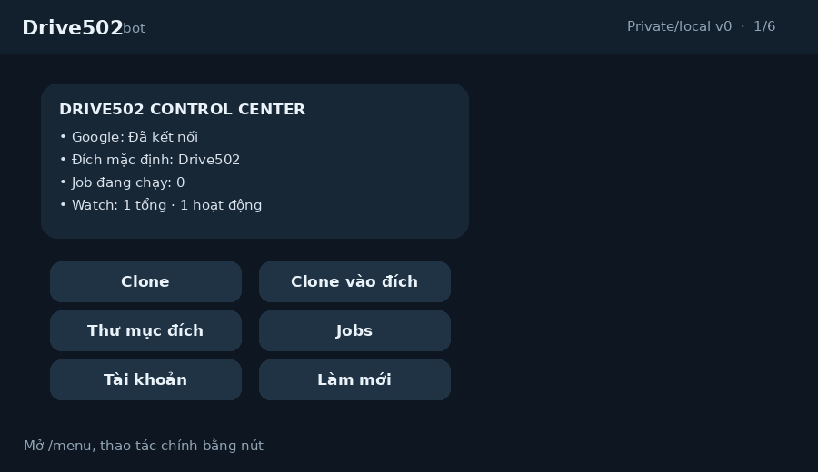

# 502Drive

502Drive là bot Telegram local-first để clone file/thư mục Google Drive và, về sau, theo dõi thư mục nguồn để áp dụng thay đổi sang thư mục đích.

Bot chạy trên máy của bạn bằng Telegram long polling, Google OAuth local, SQLite local và Google Drive API. Không cần VPS, webhook, domain public, Docker hay xoay service account.

[English README](README.md)



## Tính Năng

- Clone file hoặc thư mục Google Drive từ URL dán vào Telegram.
- Duyệt My Drive và Shared Drives bằng nút bấm trong Telegram.
- Lưu và đổi thư mục đích mặc định.
- Theo dõi job clone với pause, resume, cancel, retry và report JSON/CSV.
- Mở bảng điều khiển bằng `/menu`.
- Theo dõi thư mục nguồn và áp dụng thay đổi sang thư mục đích.
- Hỗ trợ UI Telegram tiếng Việt hoặc tiếng Anh qua `telegram.language = "vi"` hoặc `"en"`.

## Trạng Thái

Đã sẵn sàng để test local trên Linux/CachyOS:

- OAuth login.
- One-shot clone.
- Chọn thư mục đích.
- Điều khiển job.
- Report.
- Telegram control center.
- Linux `systemd --user` service.

Đang hoàn thiện trước public release:

- i18n đầy đủ cho mọi message body/error/report caption.
- Watch reconciliation khi bot nghỉ lâu hoặc backlog lớn.
- Kiểm thử thật trên Windows.
- Release binary và packaging.

## Vì Sao Local-First?

Nhiều bot Telegram Drive hiện có thiên về mirror/leech: tải torrent, direct link, archive, rồi upload lên cloud. 502Drive đi hẹp hơn: Google Drive-to-Google Drive bằng tài khoản Google cá nhân.

Local-first hợp với hướng này vì:

- Google OAuth local dễ setup và an toàn hơn cho người dùng cá nhân.
- Không cần webhook, TLS, reverse proxy hoặc domain.
- SQLite, log và report nằm local.
- Có thể chạy bền bằng user service.

Docker Compose có thể thêm sau cho NAS/homelab, nhưng không nên là bắt buộc ở v1.

## Cài Nhanh

Tạo config:

```bash
mkdir -p ~/.config/gdclone-bot
cp config.sample.toml ~/.config/gdclone-bot/config.toml
```

Điền các giá trị bắt buộc:

```toml
[telegram]
bot_token = "..."
owner_telegram_id = 123456789
language = "vi" # vi | en

[google_oauth]
client_id = "..."
client_secret = "..."
```

Login Google và kiểm tra:

```bash
cargo run -- auth login
cargo run -- doctor
```

`doctor` sẽ báo mục nào đã ổn và mục nào còn thiếu: Telegram, OAuth, Google login/token refresh, tài khoản Drive, database, report và thư mục đích mặc định.

Chạy bot:

```bash
cargo run -- run
```

Trong Telegram, gửi:

```text
/menu
```

## UX Telegram

Mục tiêu là thao tác bằng nút, ít phải nhớ command dài:

- Home: tài khoản Google, thư mục đích, jobs, watches.
- Jobs: danh sách, chi tiết, pause, resume, cancel.
- Destination: thư mục gần đây, duyệt My Drive, duyệt Shared Drive.
- Watches: danh sách, chi tiết, pause, resume, stop, policy.

Bot ưu tiên một control-center message có thể edit thay vì gửi menu mới liên tục, để chat không bị đẩy lên bởi command spam.

## Phát Triển

```bash
cargo fmt --check
cargo test
cargo build --release
```

Khi thêm tính năng:

- Text Telegram mới phải hỗ trợ cả `vi` và `en`.
- Hành động nguy hiểm phải có confirmation.
- Ghi Drive phải có state bền trước khi gọi API.
- Config mới phải được ghi trong `config.sample.toml`.

## An Toàn

502Drive không vượt quyền Google Drive, không scrape, không xoay service account, không bypass download-disabled file và không né quota.

Không commit:

- `config.toml`
- OAuth token
- `master.key`
- `*.db`, `*.db-wal`, `*.db-shm`
- log
- report

## Tác Giả

- Author: PGH
- Project/team: LanManTeam

## Tài Liệu

- [Private/local runbook](docs/private-local.vi.md)
- [Architecture](docs/architecture.md)
- [Google OAuth setup](docs/google-oauth-setup.md)
- [CachyOS setup](docs/cachyos-setup.md)
- [Windows setup](docs/windows-setup.md)
- [Watch semantics](docs/watch-semantics.md)
- [Troubleshooting](docs/troubleshooting.md)
- [Security](SECURITY.md)

## License

502Drive dùng GNU General Public License version 3 only (`GPL-3.0-only`).

Copyright (C) 2026 PGH / LanManTeam.

Xem full license trong [LICENSE](LICENSE).
