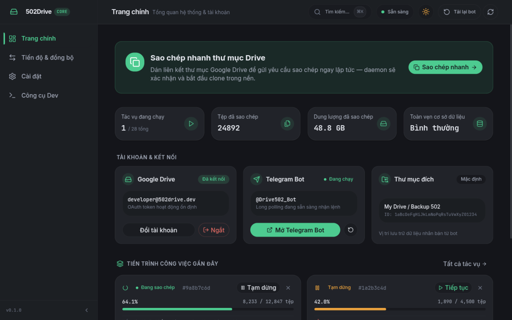
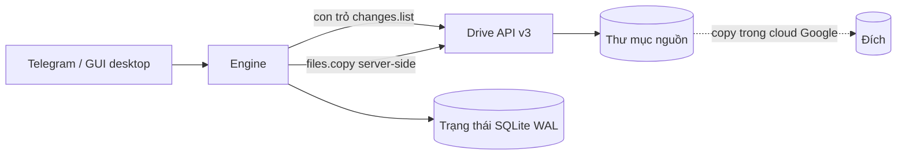

<div align="center">

# 502Drive

**Bản sao Google Drive local-first & engine đồng bộ một chiều realtime — điều khiển qua Telegram hoặc GUI desktop.**

[](https://github.com/GiaHung07/502Drive/actions/workflows/ci.yml)
[](https://github.com/GiaHung07/502Drive/actions/workflows/release.yml)
[](https://github.com/GiaHung07/502Drive/releases)
[](https://www.rust-lang.org/)
[](LICENSE)
[](https://github.com/GiaHung07/502Drive/releases)

[English README](README.md)



</div>

---

## 502Drive là gì?

502Drive là **bản sao Google Drive (clone) chạy local-first** kết hợp **engine đồng bộ một chiều (one-way) realtime**, được viết bằng Rust. Bạn điều khiển nó qua **bot Telegram** (clone cloud-to-cloud, quản lý job, quản lý watch) và qua **GUI desktop Tauri v2** (React 19) trên Linux.

Mọi thứ — database, khóa mã hóa, log — đều nằm trên máy của chính bạn. Dữ liệu file không bao giờ đi qua 502Drive: thao tác copy được thực thi **server-side ngay trong hạ tầng cloud của Google** thông qua Drive API.

> **Một binary, ba cái tên.** Repo biên dịch một file `src/main.rs` duy nhất thành hai binary hoạt động giống hệt nhau:
> - **`502drive`** — daemon/CLI chính (tên chuẩn).
> - **`gdclone-bot`** — alias của cùng một binary (giữ lại vì lý do lịch sử/đường dẫn cấu hình; thư mục config là `~/.config/gdclone-bot/`).
> - **`502drive-gui`** — ứng dụng desktop Tauri, là binary riêng biệt.
>
> Tài liệu có thể dùng `502drive` hoặc `gdclone-bot` — đó là cùng một chương trình.

## Vì sao chọn 502Drive?

- **Copy server-side = nhanh & tiết kiệm băng thông.** Clone dùng `files.copy` ngay bên trong hạ tầng của Google — không cần relay tải xuống/tải lên, hoàn tất trong vài giây, gần như không tốn băng thông máy chủ của bạn.
- **Local-first.** Token, trạng thái và báo cáo nằm trong SQLite ngay trên phần cứng của bạn — không phải trên server của người khác.
- **BYOK (Bring Your Own Keys).** Dùng Google Cloud OAuth Client ID/Secret của chính bạn (giống rclone), hoặc dùng preset 1-chạm trong setup wizard của GUI.
- **Điều khiển Telegram + GUI desktop.** Quản lý clone, job và watch realtime từ khung chat; theo dõi mọi thứ trên dashboard desktop native.

## Trạng thái tính năng

| Khả năng | Trạng thái |
| :--- | :--- |
| Clone cloud-to-cloud (`files.copy`, thư mục & Shared Drives) | ✅ Hoạt động |
| Watch một chiều realtime (nguồn → đích, Drive Changes API) | ✅ Hoạt động |
| Điều khiển qua bot Telegram (job, watch, destination, phân quyền) | ✅ Hoạt động |
| GUI desktop dashboard (Tauri v2 / React 19, Linux) | ✅ Hoạt động |
| Kiểm tra doctor / preflight | ✅ Hoạt động |
| Daemon headless qua Docker | ✅ Hoạt động |
| Build Windows + cài đặt Task Scheduler | 🟡 Mong cộng đồng xác nhận |
| Đồng bộ hai chiều | 🚧 Đang phát triển / roadmap |
| Drive push webhooks (VPS, không cần polling) | 🚧 Đang phát triển / roadmap |
| UI đa tài khoản | 🚧 Đang phát triển / roadmap |
| Folder browser trong GUI | 🚧 Đang phát triển / roadmap |

## Bắt đầu nhanh

> Cần có Telegram bot token (từ [@BotFather](https://t.me/BotFather)), Telegram user ID của bạn và Google OAuth credentials — xem [docs/oauth-setup.md](docs/oauth-setup.md).

### 1. Docker Compose (VPS / NAS / homelab)

```bash
git clone https://github.com/GiaHung07/502Drive.git && cd 502Drive
mkdir -p config data
cp config.sample.toml config/config.toml
# Sửa config/config.toml: bot_token, owner_telegram_id, google_oauth client_id/secret
docker compose up -d
docker compose logs -f
```

Hướng dẫn đầy đủ: [docs/install-docker.md](docs/install-docker.md).

### 2. Install script trên Linux + systemd user service

```bash
# Tải và giải nén bản release (x86_64 / aarch64)
tar -xzf 502drive-v*-linux-x86_64.tar.gz && cd 502drive-v*-linux-x86_64
# Cài binary, asset tray và systemd user service
bash packaging/install.sh
systemctl --user enable --now gdclone-bot.service
```

### 3. Build từ mã nguồn

```bash
git clone https://github.com/GiaHung07/502Drive.git && cd 502Drive
cargo build --release --bin 502drive
./target/release/502drive --help
```

Yêu cầu Rust 1.85+ (bản 2024 edition).

### Windows

Bản build Windows đi kèm trình cài đặt logon-task qua Task Scheduler (lệnh `502drive service-install`). Xem [docs/install-windows.md](docs/install-windows.md). Windows chưa được xác minh đầy đủ — rất hoan nghênh cộng đồng thử nghiệm và báo lỗi. Linux và Docker là nền tảng chính.

## Cơ chế đồng bộ

Đồng bộ là **một chiều: nguồn → đích**, được vận hành bởi Google Drive **Changes API** (`changes.list`, poll ở phạm vi toàn account). Thư mục đích là đích mirror — các chỉnh sửa thực hiện ở đích không bao giờ được copy ngược lại.



- **Polling thích ứng (adaptive polling)**: 10s / 60s / 300s (active / warm / cold). Khi nguồn đang thay đổi liên tục, các chỉnh sửa thường xuất hiện ở đích trong vòng vài giây đến vài chục giây; watch rảnh việc sẽ tự động giảm tần suất.
- **Chính sách xóa (deletion policy)** — mặc định `preserve_destination`: nếu file nguồn bị xóa, đưa vào thùng rác hoặc mất quyền truy cập, bản copy ở đích vẫn **được giữ lại**.
- **Move-out** — `detach`: file bị di chuyển ra khỏi thư mục nguồn sẽ được ngắt liên kết khỏi mapping của watch (di chuyển quay lại sẽ tái sử dụng mapping hiện có).
- **Chính sách cập nhật nội dung** (đổi qua `/watch_policy`): `versioned_copy` (mặc định — tạo bản copy mới cạnh bản cũ), `replace_copy` (ghi đè tại chỗ), `manual_confirmation` (hỏi trước khi áp dụng).

Semantics đầy đủ: [docs/sync-semantics.md](docs/sync-semantics.md).

**Toàn vẹn engine:** trạng thái lưu trong SQLite (chế độ WAL) với con trỏ thay đổi transactional, idempotency key và crash recovery — lần chạy bị gián đoạn sẽ tiếp tục mà không nhân đôi công việc. Mọi thao tác copy đều chạy server-side (`files.copy`), nên nội dung file không bao giờ đi qua ứng dụng.

## Cấu hình

File cấu hình: `~/.config/gdclone-bot/config.toml` (native/desktop) hoặc `/config/config.toml` (Docker). Mọi giá trị đều có thể ghi đè bằng biến môi trường theo mẫu `GDCLONE__SECTION__KEY` (hai dấu gạch dưới). Tham khảo đầy đủ: [config.sample.toml](config.sample.toml).

```toml
[telegram]
bot_token = "123456789:ABC..."        # lấy từ @BotFather
owner_telegram_id = 987654321          # Telegram user ID của bạn (/whoami)
language = "vi"                        # "vi" | "en"

[google_oauth]
client_id = "YOUR_ID.apps.googleusercontent.com"   # BYOK: OAuth client của bạn
client_secret = "YOUR_SECRET"
redirect_port_start = 51000            # dải OAuth loopback 51000-51100
redirect_port_end = 51100

[engine]
max_active_jobs = 2
initial_write_concurrency = 5

[watch]
enabled = false                        # watch realtime mặc định tắt (opt-in)
default_content_update_policy = "versioned_copy"
default_deletion_policy = "preserve_destination"
default_move_out_policy = "detach"
```

Các biến môi trường chính (đều theo mẫu `GDCLONE__SECTION__KEY`):

| Biến | Ghi đè |
| :--- | :--- |
| `GDCLONE__TELEGRAM__BOT_TOKEN` | Telegram bot token |
| `GDCLONE__TELEGRAM__OWNER_TELEGRAM_ID` | Telegram user ID của owner |
| `GDCLONE__TELEGRAM__LANGUAGE` | Ngôn ngữ UI (`vi` / `en`) |
| `GDCLONE__GOOGLE_OAUTH__CLIENT_ID` | Google OAuth Client ID |
| `GDCLONE__GOOGLE_OAUTH__CLIENT_SECRET` | Google OAuth Client Secret |
| `GDCLONE__GOOGLE_OAUTH__SCOPE` | OAuth scope |
| `GDCLONE__ENGINE__MAX_ACTIVE_JOBS` | Số job chạy đồng thời tối đa |
| `GDCLONE__ENGINE__INITIAL_WRITE_CONCURRENCY` | Độ song song khi copy |
| `GDCLONE__ENGINE__MAX_RETRY_ATTEMPTS` | Số lần retry tối đa mỗi item |
| `GDCLONE__STORAGE__DB_PATH` | Đường dẫn database SQLite |
| `GDCLONE__STORAGE__LOG_DIR` / `GDCLONE__STORAGE__REPORT_DIR` | Thư mục log / báo cáo |

## Lệnh Telegram

Bắt đầu bằng `/start`, sau đó `/connect` để liên kết tài khoản Google. Các lệnh hữu ích nhất:

| Lệnh | Mô tả |
| :--- | :--- |
| `/connect` | Hướng dẫn đăng nhập Google trên máy đang chạy bot |
| `/account` | Trạng thái tài khoản Google |
| `/clone <url_hoặc_id>` | Xem trước và clone file/thư mục Drive (copy server-side) |
| `/clone_here <url_hoặc_id>` | Clone ngay vào thư mục đích mặc định |
| `/sync <nguồn> [đích]` | Tạo watch một chiều realtime (tự dùng đích mặc định nếu bỏ trống) |
| `/watches` · `/watch_status <id>` | Liệt kê watch · xem backlog, cursor và chính sách |
| `/watch_pause <id>` · `/watch_resume <id>` | Tạm dừng/tiếp tục áp dụng thay đổi |
| `/watch_policy <id> <policy>` | Đổi chính sách cập nhật (`versioned_copy` \| `replace_copy` \| `manual_confirmation`) |
| `/unwatch <id>` | Dừng watch và xóa đăng ký theo dõi |
| `/set_destination <url_hoặc_id>` · `/destination` · `/clear_destination` | Quản lý thư mục đích mặc định |
| `/jobs` · `/status [job_id]` | Liệt kê job · xem chi tiết một job |
| `/pause` · `/resume` · `/cancel` · `/retry` | Điều khiển job (theo job id) |
| `/last_report` | Nhận báo cáo JSON/CSV của job gần nhất |
| `/grant <user_id>` · `/revoke <user_id>` | Owner quản lý allowlist operator |
| `/whoami` | Telegram ID và mức quyền của bạn |

Danh sách đầy đủ có sẵn trong bot qua `/help`.

## GUI desktop (Linux)

502Drive đi kèm ứng dụng desktop Tauri v2 (`502drive-gui`, React 19) cho Linux.

- **Dashboard** — thống kê cùng các thẻ account / bot / destination và job gần đây.
- **Jobs** — tìm kiếm và bộ lọc, pause / resume / cancel.
- **Settings** — độ song song engine, theme tối/sáng, ngôn ngữ (vi/en), cấu hình bot qua **setup wizard 4 bước** (bao gồm preset 1-chạm cho Google OAuth credentials).
- **Dev tools** — chẩn đoán doctor và log.
- **Ưu tiên bàn phím** — `⌘K` mở command palette.

<div align="center">
<!-- Ảnh giao diện sáng được lược bỏ có chủ đích; ứng dụng mặc định dark-first -->
</div>

## Bảo mật & quyền riêng tư

- **Không dùng system keyring** — Google refresh token được mã hóa bằng **AES-256-GCM**; khóa lưu trong file `master.key` cục bộ với quyền `0600`.
- **OAuth** — luồng installed-app loopback với PKCE trên các port 51000–51100; không có redirect endpoint công khai.
- **Phân quyền Telegram** — allowlist owner/operator; **mọi tin nhắn đến đều được kiểm tra** trước khi lệnh nào được thực thi.
- **Không có bề mặt tấn công công khai** — Telegram long polling + OAuth loopback nghĩa là không cần mở port inbound nào.
- Nội dung file không bao giờ đi qua 502Drive (chỉ copy server-side).

Chi tiết: [PRIVACY.md](PRIVACY.md) · [docs/threat-model.md](docs/threat-model.md) · [SECURITY.md](SECURITY.md)

## FAQ

**Xóa file ở nguồn có làm mất file ở đích không?**
Không. Chính sách xóa mặc định là `preserve_destination` — file ở đích vẫn tồn tại khi nguồn bị xóa, đưa vào thùng rác hoặc mất quyền truy cập. Move-out chỉ ngắt mapping chứ không xóa gì cả.

**Đồng bộ realtime nhanh cỡ nào?**
Polling thích ứng theo mức độ hoạt động: 10s khi nguồn đang thay đổi liên tục, giảm dần còn 60s và 300s khi rảnh. Trên thực tế, thay đổi được áp dụng trong vòng vài giây đến vài chục giây khi watch đang active.

**Có tốn băng thông máy chủ của tôi không?**
Gần như không. Clone dùng `files.copy` server-side của Google; dữ liệu file di chuyển bên trong cloud của Google chứ không qua máy của bạn.

**Dữ liệu của tôi nằm ở đâu?**
Trên máy của bạn: database SQLite cục bộ, token đã mã hóa và `master.key`. Không có gì được lưu trên server bên thứ ba ngoài kênh truyền tin của Telegram.

**Vì sao tôi cần Google OAuth Client ID/Secret riêng (BYOK)?**
Google giới hạn OAuth app ở chế độ testing tối đa 100 user. 502Drive theo mô hình rclone: dùng Client ID/Secret của chính bạn (xem [docs/oauth-setup.md](docs/oauth-setup.md)), hoặc dùng preset 1-chạm trong setup wizard của GUI.

**Windows có được hỗ trợ không?**
Bản build Windows và trình cài đặt logon-task qua Task Scheduler (`service-install`) đã có mặt, nhưng việc xác minh đầy đủ vẫn đang tiếp tục — rất hoan nghênh cộng đồng thử nghiệm. Linux và Docker là nền tảng chính.

## Tài liệu

| Tài liệu | Nội dung |
| :--- | :--- |
| [docs/install-docker.md](docs/install-docker.md) | Triển khai Docker Compose |
| [docs/install-windows.md](docs/install-windows.md) | Cài đặt Windows & Task Scheduler |
| [docs/oauth-setup.md](docs/oauth-setup.md) | Thiết lập Google Cloud OAuth (BYOK) |
| [docs/sync-semantics.md](docs/sync-semantics.md) | Semantics watch một chiều & chính sách |
| [docs/architecture.md](docs/architecture.md) | Kiến trúc hệ thống |
| [docs/architecture.md](docs/architecture.md) | Kiến trúc ADR, recovery & toàn vẹn dữ liệu |
| [docs/threat-model.md](docs/threat-model.md) | Threat model |
| [docs/troubleshooting.md](docs/troubleshooting.md) | Sự cố thường gặp |
| [docs/install-linux.md](docs/install-linux.md) | Cài đặt Linux & systemd user service |

## Roadmap

- Đồng bộ hai chiều
- Drive push webhooks (watch theo sự kiện trên VPS)
- UI đa tài khoản
- Folder browser trong GUI

## Đóng góp

Rất hoan nghênh đóng góp — xem [CONTRIBUTING.md](CONTRIBUTING.md). Với vấn đề bảo mật, vui lòng làm theo [SECURITY.md](SECURITY.md) thay vì mở issue công khai.

## Giấy phép

Phát hành theo **GNU GPL-3.0** — xem [LICENSE](LICENSE). Thông báo bên thứ ba: [THIRD_PARTY_NOTICES.md](THIRD_PARTY_NOTICES.md).

**Quyền riêng tư:** 502Drive là local-first — token, database và báo cáo của bạn nằm trên phần cứng của bạn. Xem [PRIVACY.md](PRIVACY.md) để biết những gì được (và không được) truyền đi.
